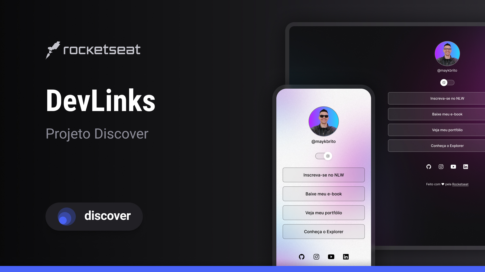

<h1 align="center">DevLinks</h1>

  Projeto desenvolvido durante o programa <strong>Discover</strong>, promovido pela <a href="https://www.rocketseat.com.br/">Rocketseat</a>, para aprendizado de tecnologias web.

  <a href="#-tecnologias">Tecnologias</a>&nbsp;&nbsp;&nbsp;|&nbsp;&nbsp;&nbsp;
  <a href="#-projeto">Projeto</a>&nbsp;&nbsp;&nbsp;|&nbsp;&nbsp;&nbsp;
  <a href="#-layout">Layout</a>&nbsp;&nbsp;&nbsp;|&nbsp;&nbsp;&nbsp;
  <a href="#memo-licença">Licença</a>

  

 

## 🚀 Tecnologias

Esse projeto foi desenvolvido com as seguintes tecnologias:

- HTML e CSS
- JavaScript
- Git e GitHub
- Figma

## 💻 Projeto

O **DevLinks** é um agregador de links para ser usado como um cartão de visitas online.

## 🔖 Layout

Você pode visualizar o layout do projeto através [**desse link no Figma**](https://www.figma.com/design/RaY3KZ22K823VkyyWalZGR/DevLinks-%E2%80%A2-Projeto-Discover--Community-?node-id=10-620&p=f&t=UqV4DyzkivrHyZzs-0).  
É necessário ter uma conta no [Figma](https://figma.com) para acessá-lo.

## :memo: Licença

Esse projeto está sob a licença **MIT**.

---
